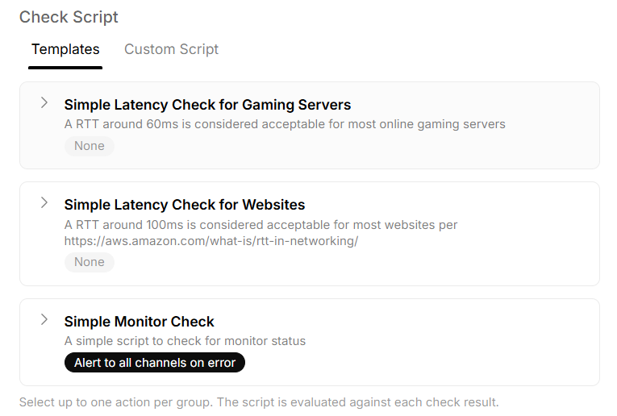
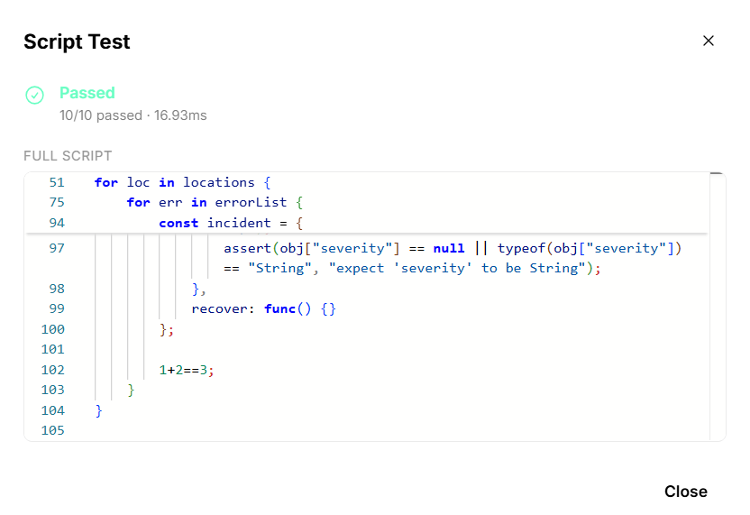

# Check Scripts

This repository hosts:
1. Official and community-made templates for check scripts on active monitoring


2. Samples for running tests


## [Contribute] Templates

The `templates/` directory contains reusable [Rice](https://github.com/anhcraft/rice) script templates organized per folder.
- [Learn](https://github.com/anhcraft/rice/tree/main/guides) Rice
- [Try](https://rice-playground.vercel.app/) the playground

### Structure

```
templates/
├── bundle.json                 # Generated bundle of all templates
├── schema.json                 # Manifest JSON schema
└── {template-name}/
    ├── manifest.yml            # Template metadata + variant list
    └── scripts/
        └── {variant}.rice      # Rice script per variant
```

### Step 1: Manifest schema and Script files

Each template folder contains a `manifest.yml` (YAML) defining the template name, description, and variants. Each variant references a `scriptFile` — the relative path to its Rice script.

### Step 2: Bundling templates

Bundle all templates into a single self-contained `bundle.json`, embedding each script's content directly:

```
go run ./tools/bundle_templates.go
```

## [Contribute] Test Samples

The `test-samples/` directory contains mock check results used to validate check scripts.

### Structure

```
test-samples/
├── bundle.json          # Auto-generated bundle of all samples (inlined metadata + payload)
├── index.json           # Auto-generated index of all samples
└── src/{protocol}/      # Sample files organized by protocol (http, https, tcp, tls, minecraft)
    ├── {sample}.json    # Metadata (check result payload)
    └── {sample}.txt     # Payload (request debug dump)
```

### Step 1: Indexing samples

Scan all sample files and regenerate `index.json`:

```
go run ./tools/index_test_samples.go
```

### Step 2: Bundling samples

Bundle all samples into a single self-contained `bundle.json`, embedding each sample's metadata and payload inline as Base64:

```
go run ./tools/bundle_test_samples.go
```

## [Other] Template Testing

The `template-testing/` directory contains the test runner that validates every template variant against all test samples.

### Structure

```
template-testing/
├── eat.rice          # Test script template — uses `#{{__script__}}` placeholder injected at runtime
├── main.go           # Minimal entry point
└── main_test.go      # Test runner — executes eat.rice + each variant script against all indexed samples
```

### How it works

`main_test.go` loads `templates/bundle.json` and `test-samples/index.json`, then for each template variant injects its script into the `eat.rice` template (replacing the `#{{__script__}}` placeholder) and executes the combined script against every test sample.

### Running tests

Execute the Rice test script against every sample:

```
go test ./template-testing/... -v
```
